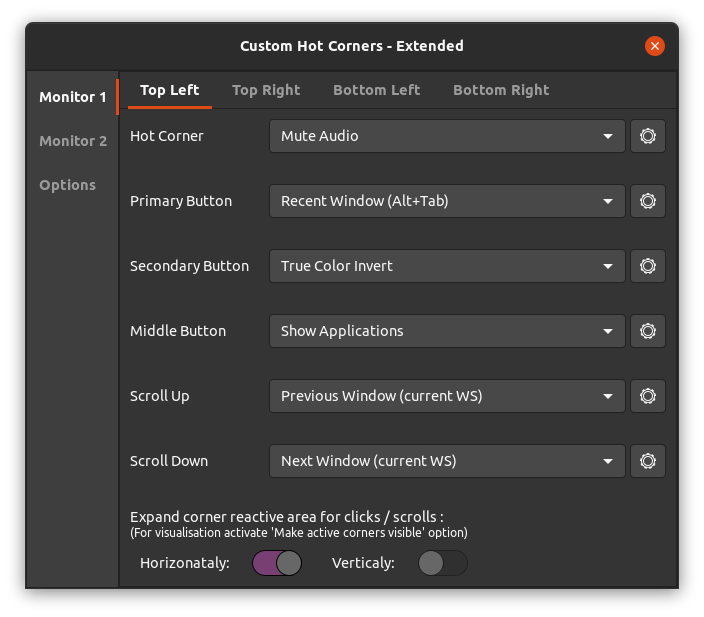
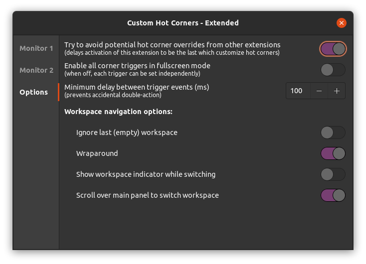
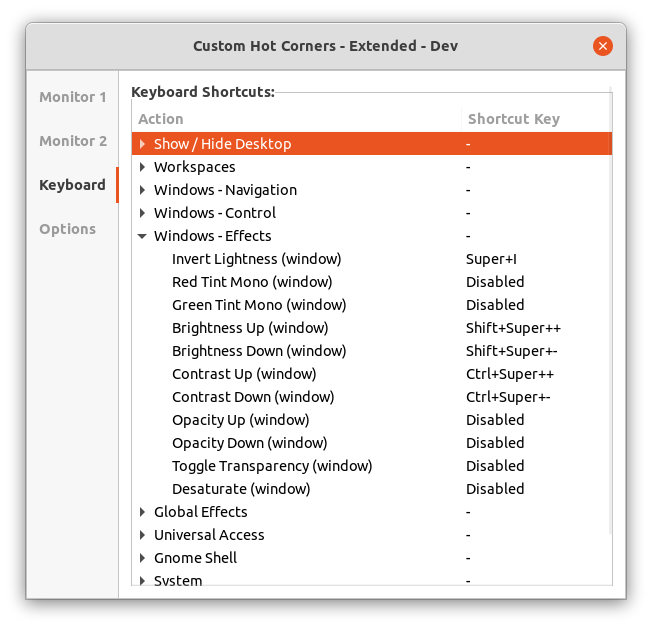
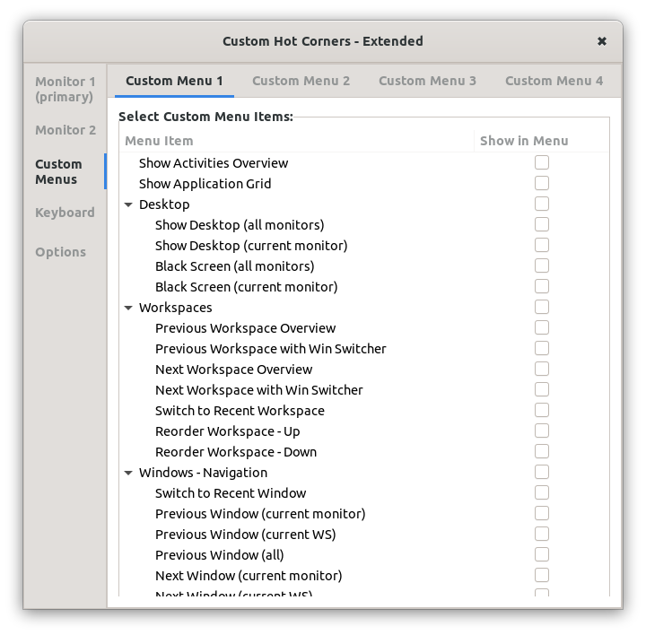

# Custom Hot Corners - Extended

A GNOME Shell Extension which allows you to control and navigate Gnome Shell environment through the corners and edges of your monitors. But not just that, it adds many unique actions with keyboard shortcuts too.

## Features:
- Gnome 3.36, 3.38 and 40 compatibility
- Hot corners with adjustable barrier sizes, both vertical and horizontal independently and usable as hot edges
- Mouse buttons and a scroll wheel can be used as triggers in addition to hot corners
- Each trigger can be set to work only when *Ctrl* key is pressed
- Each direcion of a scroll wheel rotation is configurable independently
- Each trigger can activate one of many actions including command execution, workspace and window navigation, window control, power manager actions, sound volume control, color filters (for windows and global), accessibility features and more.
- Preferences window provides an app chooser dialog for "Run preset Command" action configuration - easy use as an application launcher
- Each corner's area reactive to mouse clicks and scrolls can be extended both horizontally and/or vertically to cover most lenght of the monitor's edges. If the adjacent corner is not set to expand in related direction, the corner can be expanded to 7/8 of the monitor's width/height. If two adjacents corners are set to expand to each other's direction, then it is 1/2 of the length for each. You can see the result of expansion settings by activation of the *Make active corners/edges visible* option.
- Fallback hot corner triggers as option - useful on virtualized systems where pressure barriers are supported by the system but ignored by the pointer.
- Various options for window and workspace switchers
- The `Monitor 1` settings are always used on the primary monitor
- Corners can be watched for unwanted overrides from other extensions and automatically updated when needed within 3 seconds
- You can set keyboard shortcuts for any actions on the menu.
- You can set up to 4 Custom Menus with own selection of actions and trigger them as an action.

## Changelog:

**v9**:
- *Ctrl* "safety lock" finally works with Wayland
- Pressure barrier sizes are now adjustable by scale controllers on the main corner page along with clickable area expansion for better orientation in settings.
- Barrier size is now adjustable in percentage of the monitor's width/heigt instead of pixels.
- Option *Make active corners/edges visible* now show the pressure barriers too.
- Added action **Window Thumbnail (PIP)** - make a thumbnail preview (like Picture in Picture) of the active window which you can drag and drop anywhere on the screen. Thumbnail size can be adjusted by a mouse scroll wheel and you can even change the source window of the thumbnail. You can make as many thumbnails as you want, not just one.
- Added new shader filters - color blind vision simulation and correction filters in Accessibility menu. Inversion filters have been enhanced - Invert Lightness, Invert Lightness - Wite to Grey (for lower contrast at night time) and full color inversion, now all gamma corrected to make deep dark shades distinguishable.
- Added actions to trigger default Window and App Switcher Pop-ups. When you install and enable the **Advanced Alt+TAb Window Switcher** extension you'll be able to use more actions with diffrent settigs of this extended window switcher pop-up.
- Added 4 **Custom Menus** to action menu - you can populate up to 4 different menus with actions of your choice and trigger them the same way as other single actions.
- Added **Minimize to thumbnail** action - live window thumbnail of the focused window will be created and window will be minimized.
- Workspace switcher has **new** optional **workspace switcher indicator - overlay index**. Shows a big transparent index number of switched workspace on the bottom half of the screen.

**v8**:
- **Optional keyboard shortcuts for most actions** - CHC-E offers many unique actions which can be now used even without a mouse
- The *Invert Lightness* action is now available in Gnome 40
- Toggle Light/Dark GTK theme action - supports Adwaita and Ubuntu Yaru(Light) themes
- Multiple color effect actions for whole desktop and single windows including **red/green color tint, contrast, brightness, transparency and system Night Light switch**
- *Reorder workspace* action alows you to move whole workspace up/down (left/right in gnome 40) in the workspace list.

### DND Window Thumbnails

Window thumbnails are scaled-down window clones that can be used to monitor windows not currently visible on the screen. Default position for the thumbnail is bottom right corner of the current monitor. You can create as many clones as you want and place them anywhere on the screen. Each thumbnail can be independently resized, you can adjust its opacity, even change its source window. When the thumbnail's source window close, thumbnail is removed too.
The code is based on window preview of *BaBar Task Bar* extension.

    Double click          - activate source window
    Primary cLick         - toggle scroll wheel function (resize / source)
    Scroll wheel          - resize or switch source window
    Ctrl + Scroll wheel   - switch source window or resize
    Secondary click       - remove thumbnail
    Middle click          - close source window
    Shift + Scroll wheel  - change thumbnail opacity

### Installation

Install the extension from the from the [GNOME extension website](https://extensions.gnome.org/extension/4167/custom-hot-corners-extended/) or from git repository with the following steps (which require the GNU Build System):

    autoreconf -i
    ./configure
    make local-install
