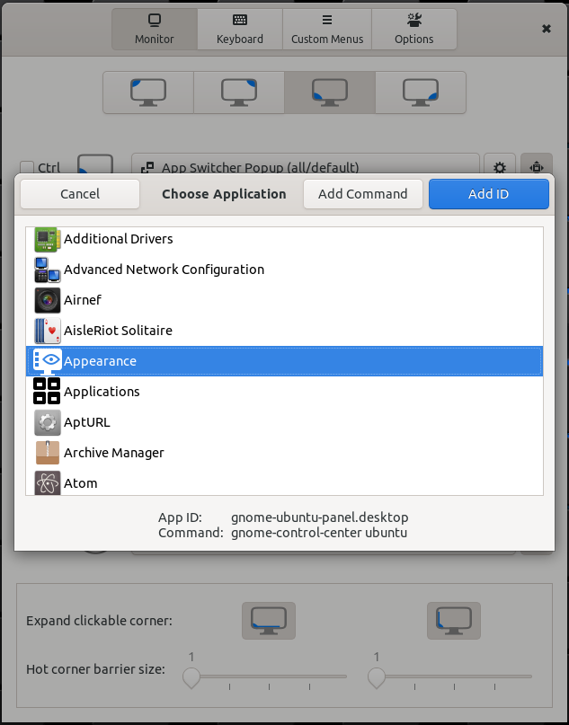

# Custom Hot Corners - Extended

A GNOME Shell Extension which allows you to control and navigate Gnome Shell environment through the corners and edges of your monitors. But not just that, it adds many unique actions with keyboard shortcuts too.

## Changelog:

**v9**:
- *Ctrl* safety lock finally works with Wayland
- Added action *Window Thumbnail (PIP)* - make a thumbnail preview (like Picture in Picture) of the active window which you can drag and drop anywhere on the screen. Thumbnail size can be adjusted by a mouse scroll wheel and you can even change the source window of the thumbnail the same way if you hold Ctrl key pressed. Or click the primary button ones to switch this controls, so you don't even need a keyboard to switch the source. Right click closes the thumbnail, double click activates the source window, Shift key + scroll for opacity adjustment. You can make as many thumbnails as you want, not just one.
- Added new shader filters - you'll find color blind vision simulation and correction filters in accessibility menu. Inversion filters have been enhanced - Invert Lightness, Invert Lightness - Wite to Grey (for lower contrast at night time) and full color inversion, now all gamma corrected to make deep dark shades distinguishable.
- Added actions to activate **extended Window Switcher Pop-up** with many filter and order settings. It can even filter windows by typing, change default position including position at mouse pointer. Many keyboard shortcuts to control windows and navigate through workspaces.
- Added action to show App Switcher Pop-up with no upgrades. Just because I can...
- Added 4 custom menus to action menu - actions that open menu with selected actions.
- Workspace switcher has new optional switching indicator - overlay index. Shows big transparent index number of switched workspace in the bottom area of the screen.

**v8**:
- **Optional keyboard shortcuts for most actions** - CHC-E offers many unique actions which can be now used even without a mouse
- The *Invert Lightness* action is now available in Gnome 40
- Toggle Light/Dark GTK theme action - supports Adwaita and Ubuntu Yaru(Light) themes
- Multiple color effect actions for whole desktop and single windows including **red/green color tint, contrast, brightness, transparency and system Night Light switch**
- *Reorder workspace* action alows you to move whole workspace up/down (left/right in gnome 40) in the workspace list.

## Features:
- Gnome 3.36, 3.38 and 40 compatibility
- Hot corners with adjustable barrier sizes, both vertical and horizontal adjustable independently and usable as hot edges
- Mouse buttons and a scroll wheel can be used as triggers in addition to hot corners
- Each trigger can be set to work only when Ctrl key is pressed (except hot pressure trigger in Wayland where modifier keys status cannot be read)
- Each direcion of a scroll wheel rotation is configurable independently
- Each trigger can activate one of the many actions including command execution, workspace and window navigation, window control, power manager actions, sound volume control, color filters (for windows and/or global), accessibility features and more
- Preferences window provides an app chooser dialog for "Run the preset Command" action configuration - easy use as an application launcher
- Each corner's area reactive to mouse clicks and scrolls can be extended both horizontally and/or vertically to cover most lenght of the monitor's edges. If the adjacent corner is not set to expand in related direction, the corner can be expanded to 7/8 of the monitor's width/height. If two adjacents corners are set to expand to each other's direction, then it is 1/2 of the length for each. You can see the result of expansion settings by activation of the *Make active corners/edges visible* option.
- Fallback hot corner triggers as option - useful on virtualized systems where pressure barriers are supported by the system but ignored by the pointer.
- Various options for window and workspace switchers
- The `Monitor 1` settings are always used on the primary monitor
- Corners can be watched for unwanted overrides from other extensions and automatically updated when needed within 3 seconds

### Windows Switcher Navigator Pop-Up
In version 9 was added action to show the window switcher popup for easy navigtion between windows on whole desktop. I couldn't resist to make some upgrades to it and re-use some actions available in action menu. Now it's quite powefull tool which is now available as a replacement of the original Gnome switcher. You can adjust default settings in Preferences window of the extension on *Options* page, but most of the settings can be changed on the fly as you need.

#### Keyboard shortcuts:
    H/L, Left/Right         - window selection
    J/K, Up/Down, PgUp/Down - workspace selection
    Home/End                - switch to first/last workspace
    Space, KP_0/KP_Ins      - show selected window
    W/F4                    - close selected window
    F5                      - force close - kill -9 to application of selected window
    C                       - close all windows from list of the same application
    A                       - set window Allways on top (indicated by the app icon at top instead bottom part of window thumbnail). Also switch to workspace and rise the window
    S                       - set window Make visible on all workspaces, indicated by pin icon
    Q                       - switch window filter mode - All/WS/Monitor
    ;/~                     - sort windows by app/class, each subsequent key press jumps to the first window of the next app
    O                       - toggle sort by workspaces, when base filter is set to All
    1/+/X                   - filter out all windows that don't belong to the application of selected window
    M                       - move selected window to the current workspace and to monitor with mouse pointer monitor
    V                       - Move window to selected workspace and maximize it
    F                       - Move window to empty workspace next to its current workspace and switch the window to fullscreen. Next use of this action moves the window back to its original workspace and turn off the fullscreen mode.
    E/Ins                   - Switch to the search mode, then you can type and windows in the switcher will be filtered by the pattern against the window title and app name. Diacritics and case doesn't matter. You can type in two patterns delimited by a space in arbitrary order, so when you write 'fire ext' window with 'Extensions - Firefox' in the title will be found too.

## Installation

Install the extension from the from the [GNOME extension website](https://extensions.gnome.org/extension/4167/custom-hot-corners-extended/) or from git repository with the following steps (which require the GNU Build System):

    autoreconf -i
    ./configure
    make local-install
