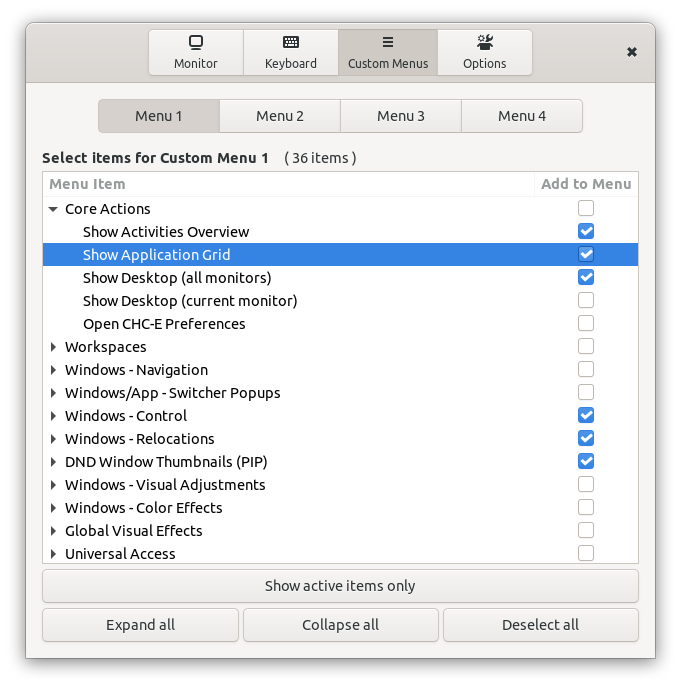

# Custom Hot Corners - Extended version

A GNOME Shell Extension for customizable hot corners and edges.

Features:

- Gnome 3.36, 3.38 and 40 compatibility
- Hot corners with adjustable barrier size (usable as hot edges)
- Mouse buttons and a scroll wheel can be used as triggers in addition to hot corners
- Each trigger can be set to work when Ctrl key is pressed (except hot pressure trigger in Wayland)
- Each direcion of a scroll wheel rotation is configurable separately
- Each trigger can activate one of the many actions including command execution, workspace and window navigation, window control, power manager actions, sound volume control, window lightness inversion, accessibility features and more
- Preferences window provides an app chooser dialog for Run Command action configuration - easy use as an application launcher
- Each corner's area reactive to mouse clicks and scrolls can be extended both horizontaly and/or verticaly to cover most lenght of the monitor's edges. If the adjacent corner is not set to expand in related direction, the corner can be expanded to 7/8 of the monitor's width/height. If two adjacents corners are set to expand to each other's direction, than it is 1/2 of the length for each. You can see the result of expansion settings by activation of the *Make active corners/edges visible* option.
- Fallback hot corner triggers as option - useful on virtualized systems where pressure barriers are supported by the system but ignored by the pointer.
- Various options for window and workspace switchers
- The *Invert Window* action is compatible with the *True Color Invert* Gnome extension. Not available in Gnome 40, needs update.
- The `Monitor 1` settings are always used on the primary monitor

## Installation

Install the extension from the from the [GNOME extension website](https://extensions.gnome.org/extension/4167/custom-hot-corners-extended/) or from git repository with the following steps (which require the GNU Build System):

    autoreconf -i
    ./configure
    make local-install
