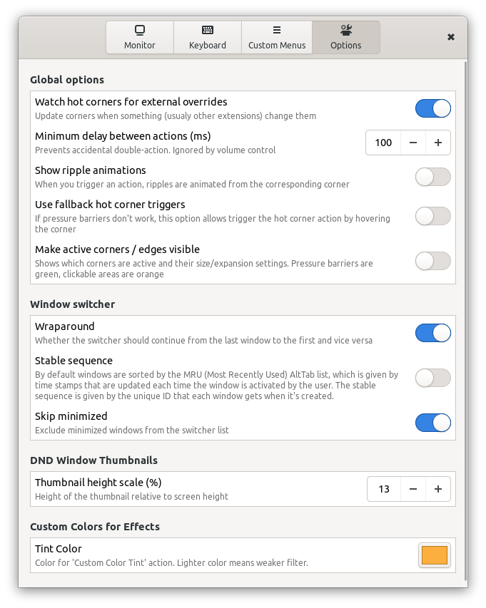

# Custom Hot Corners - Extended

A GNOME Shell Extension which allows you to control and navigate Gnome Shell environment through the corners and edges of your monitors. But not just that, it adds many unique actions with keyboard shortcuts too.

This extension is based on the original `Custom Hot Corners` exetension, but not much of the original code remains.

## Features:
- Gnome 3.36 - 42 compatibility
- Hot corners with adjustable barrier sizes, both vertical and horizontal independently and usable as hot edges
- Mouse buttons and a scroll wheel can be used as action triggers
- Each trigger can be set to work only if *Ctrl* key is pressed
- Each direcion of a scroll wheel rotation is configurable independently
- Each trigger can activate one of many actions including command execution, workspace and window navigation, window control, power manager actions, sound volume control, MPRIS player control, color filters (for windows and global), accessibility features and more.
- Preferences window provides an app chooser dialog for "Run Preset Command" action configuration - easy use as an application launcher
- Each corner's area reactive to mouse clicks and scrolls can be extended both horizontally and/or vertically to cover most lenght of the monitor's edges. If the adjacent corner is not set to expand in related direction, the corner can be expanded to 7/8 of the monitor's width/height. If two adjacents corners are set to expand to each other's direction, then it is 1/2 of the length for each. You can see the result of expansion settings using the *Make active corners/edges visible* option.
- Fallback hot corner triggers as option - can be used on virtualized systems with mouse pointer integration where pressure barriers are being ignored.
- The `Monitor 1` settings are always used on the primary monitor
- You can set global keyboard shortcuts for any actions on the menu except for those available natively in GNOME Settings.
- You can create up to 4 Custom Menus with your own selection of actions and use them as single action.

## Changelog

[CHANGELOG.md](CHANGELOG.md)

## DND Window Thumbnails

Window thumbnails are scaled-down window clones that can be used to monitor windows not currently visible on the screen. Default position for the thumbnail is bottom right corner of the current monitor. You can create as many clones as you want and place them anywhere on the screen. Each thumbnail can be independently resized, you can adjust its opacity, even change its source window. When the thumbnail's source window close, thumbnail is removed too.
The code is based on window preview of *BaBar Task Bar* extension.

    Double click          - activate source window
    Primary cLick         - toggle scroll wheel function (resize / source)
    Scroll wheel          - resize or switch source window
    Ctrl + Scroll wheel   - switch source window or resize
    Secondary click       - remove thumbnail
    Middle click          - close source window
    Shift + Scroll wheel  - change thumbnail opacity

## Installation

You can install this extension in several ways.

### Install from extensions.gnome.org

The easiest way to install Custom Hot Corners - Extended: go to [extensions.gnome.org](https://extensions.gnome.org/extension/4167/custom-hot-corners-extended/) and toggle the switch. This installation also gives you automatic updates in the future.

### Install from the latest Github release

Download the latest release archive using following command:

    wget https://github.com/G-dH/custom-hot-corners-extended/releases/latest/download/custom-hot-corners-extended@G-dH.github.com.zip

Install the extension (`--force` switch needs to be used only if some version of the extension is already installed):

    gnome-extensions install --force custom-hot-corners-extended@G-dH.github.com.zip

Then restart GNOME Shell (`ALt` + `F2`, `r`, `Enter`, or Log Out/Log In if you use Wayland). Now you should see the new extension in *Extensions* (or *GNOME Tweak Tool* on older systems) application (reopen the app too if needed to load new data), where you can enable it and access its Preferences. 

You can also enable the extension from the command line:

    gnome-extensions enable custom-hot-corners-extended@G-dH.github.com

### Install from the source using GNU Build System

If you want to test the latest development (usually working well) version from the Github repository, you can dounload and unpack source code from the `gdh` branch and install the extension with the following commands in the directory with the source code, which require the GNU Build System:

    autoreconf -i
    ./configure
    make local-install

### If you want development version without installing GNU Build System

You can also install the stable version of the extension using one of the first two methods and then download the latest source code from GitHub and ovewrite all `*.js` and `schema/*` files in the extension directory `~/.local/share/gnome-shell/extensions/custom-hot-corners-extended@G-dH.github.com`. Then restart the Shell and new code should be loaded and used.

### Install from AUR on Arch based distributions

*Custom Hot Corners - Extended* has also AUR repository maintainer (but I know nothing more about it):
[https://aur.archlinux.org/packages/gnome-shell-extension-custom-hot-corners-extended](https://aur.archlinux.org/packages/gnome-shell-extension-custom-hot-corners-extended)

## Contribution

Contributions are welcome and I will try my best to answer quickly to all suggestions. I'd really appreciate corrections of my bad english.

If you like my work and want to keep me motivated, you can also buy me a coffee:
[buymeacoffee.com/georgdh](buymeacoffee.com/georgdh)
