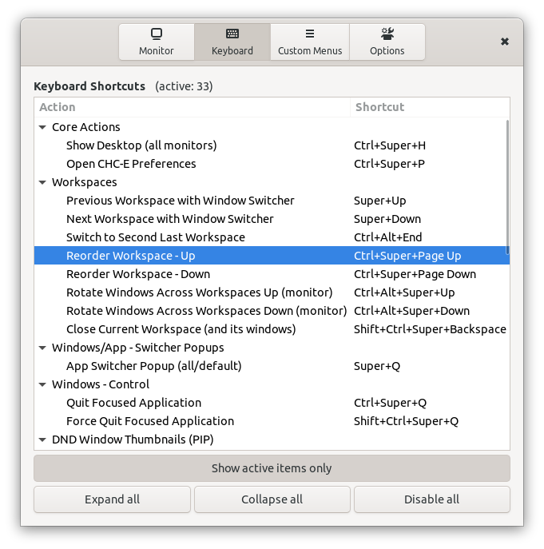

# Custom Hot Corners - Extended

A GNOME Shell Extension which allows you to control and navigate Gnome Shell environment through the corners and edges of your monitors. But not just that, it adds many unique actions with keyboard shortcuts too.

This extension is based on the original `Custom Hot Corners` exetension, but not much of the original code remains.

## Features:
- Gnome 3.36 - 42 compatibility
- Hot corners with adjustable barrier sizes, both vertical and horizontal independently and usable as hot edges
- Mouse buttons and a scroll wheel can be used as action triggers
- Each trigger can be set to work only if *Ctrl* key is pressed
- Each direcion of a scroll wheel rotation is configurable independently
- Each trigger can activate one of many actions including command execution, workspace and window navigation, window control, power manager actions, sound volume control, MPRIS player control, color filters (for windows and global), accessibility features and more.
- Preferences window provides an app chooser dialog for "Run Preset Command" action configuration - easy use as an application launcher
- Each corner's area reactive to mouse clicks and scrolls can be extended both horizontally and/or vertically to cover most lenght of the monitor's edges. If the adjacent corner is not set to expand in related direction, the corner can be expanded to 7/8 of the monitor's width/height. If two adjacents corners are set to expand to each other's direction, then it is 1/2 of the length for each. You can see the result of expansion settings by activation of the *Make active corners/edges visible* option.
- Fallback hot corner triggers as option - can be used on virtualized systems with mouse pointer integration where pressure barriers are being ignored.
- The `Monitor 1` settings are always used on the primary monitor
- Corners can be watched for unwanted overrides from other extensions and automatically updated when needed
- You can set global keyboard shortcuts for any actions on the menu except for those available natively in GNOME Settings.
- You can set up to 4 Custom Menus with your own selection of actions and use them as an single action.

## Changelog

[CHANGELOG.md](CHANGELOG.md)

## DND Window Thumbnails

Window thumbnails are scaled-down window clones that can be used to monitor windows not currently visible on the screen. Default position for the thumbnail is bottom right corner of the current monitor. You can create as many clones as you want and place them anywhere on the screen. Each thumbnail can be independently resized, you can adjust its opacity, even change its source window. When the thumbnail's source window close, thumbnail is removed too.
The code is based on window preview of *BaBar Task Bar* extension.

    Double click          - activate source window
    Primary cLick         - toggle scroll wheel function (resize / source)
    Scroll wheel          - resize or switch source window
    Ctrl + Scroll wheel   - switch source window or resize
    Secondary click       - remove thumbnail
    Middle click          - close source window
    Shift + Scroll wheel  - change thumbnail opacity

## Installation

Install the extension from the from the [GNOME extension website](https://extensions.gnome.org/extension/4167/custom-hot-corners-extended/) or from git repository with the following steps (which require the GNU Build System):

    autoreconf -i
    ./configure
    make local-install
