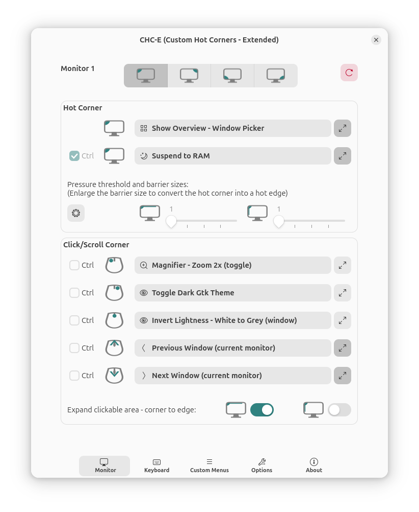

# Custom Hot Corners - Extended version

A GNOME Shell Extension for customizable hot corners.

Mouse buttons and wheel as triggers in addition to hot corners. Added actions, command action extended.

## Installation

Install the extension from the git repository with the following steps (which
require the GNU Build System):

    autoreconf -i
    ./configure
    make local-install
